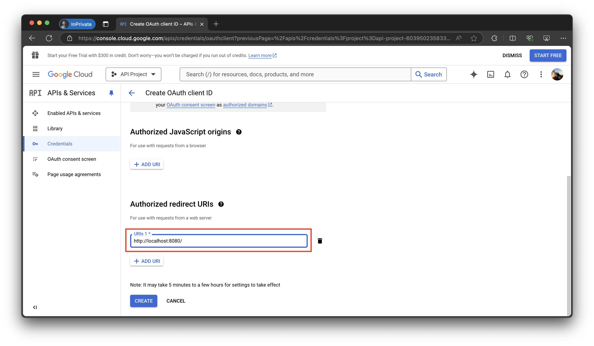

# Creating your OAuth2 Google Client ID

## Description

This document outlines how to create your own OAuth2 client ID and client secrets so that you can interact with the Google Photos and Google Drive APIs.

## Steps

1. Go to <https://cloud.google.com/cloud-console> and log into your Google account
2. Click on the "Console" button:

    

    

3. Click on the "Select Project" button and create a new project with any name:

    

    

    

    

    

    

4. Wait for your project to be created. Then select your project again:

    

    

    

    

5. Type in "Photos Library Api" in the search box, select "Photos Library Api", and click on "Enable":

    

    

    

    

    

    

6. Similarly, enable the Drive API by typing in "Drive API" in the search box, select "Drive API", and click on "Enable":

    

    

    

    

    

    

7. Create a new OAuth2 Consent Screen by going to to the APIs and Services tab, creating an External API, and fill in the details:

    

    

    

    

    

    

    

    

    

    

8. No special scopes is needed. So we can click on the `Save and Continue` button:

    

    

9. In the Test Users page, click on `Save and Continue`. We don't need to add test users since we will publish the app:

    

    

10. In the "Summary" page, scroll down and click on `Back to Dashboard` button:

    

    

11. In the main consent page, click on `Publish App`. A dialog will appear. Click on `Confirm`. It will publish the app:

    

    

12. Create the Client IDs and client secrets by going to the "Credentials" tab, clicking on "Create Credentials", select "OAuth Client ID", selecting "Web Application", and adding `http://localhost:8080/` in the authorized redirect uri:

    

    

    

    

    

    

    

    

    

    

    

    

13. Finally, click on the `Create` button. A dialog will appear with your Client ID and Client secrets. Download the file named as `client_secrets.json` and you now have your own client ID and client secrets:

    

    

    

    

